# Signals — Learning Sign Language Without an Audience

### Case Study Report

| | |
| --- | --- |
| **Name** | Sujal Pradeep Warke |
| **Roll No** | 150096724012 |
| **Cohort** | Mark Zuckerberg |
| **Case Study No** | 57 |
| **Live application** | https://signals-app-a7b29.web.app |
| **Source code** | https://github.com/sujalwarke28/Signals-Learn-Sign-Language |
| **Platforms** | Android 7.0+ · Web |

---

## 1. Problem Statement

Communication between a deaf person and a hearing person fails for a structural
reason that is easy to miss: **the burden of bridging it falls almost entirely
on the deaf person.** They are expected to lip-read, to write notes, to bring an
interpreter. The hearing majority is rarely expected to learn anything at all.

The World Health Organization estimates that over 5% of the world's population —
around 430 million people — have disabling hearing loss, and projects that
nearly 2.5 billion people will live with some degree of hearing loss by 2050. In
India, the number of certified Indian Sign Language interpreters is commonly
cited in the low hundreds, against a deaf population measured in millions. The
interpreter gap cannot realistically be closed by training interpreters alone.

The gap that *can* close is a different one: the ordinary hearing people already
in a deaf person's life — a colleague, a classmate, a neighbour, a relative —
who would learn a handful of signs if learning them were not so awkward.

Three things stop them:

**1. There is no structured path.** Sign language content online is a scatter of
unindexed videos. There is no sequence, no sense of progress, and no way to know
whether what you just copied was correct. Formal classes exist but cost money
and require being somewhere at a fixed time.

**2. The barrier is embarrassment, not difficulty.** The individual signs are
not hard. Performing them badly in front of a fluent signer is. Most people
never attempt a first conversation because they are afraid of getting it wrong
in a way that is visible and possibly offensive.

**3. Most tools frame it as charity.** Products in this space are built around
"helping the hearing impaired". That framing is both inaccurate and alienating:
sign language is a complete natural language with its own grammar, regional
variation and literature, carried by a Deaf community with its own culture. A
product that treats it as an accessibility accommodation signals, immediately,
that it was not built with that community in mind.

> **The problem in one line:** hearing people are willing to learn enough sign
> language to start a conversation, but there is no low-stakes, structured,
> free place to practise until they are no longer embarrassed.

---

## 2. Our Solution

**Signals** is a cross-platform application that teaches sign language through
short video lessons, verifies retention with quizzes, computes progress from
real results, and surrounds the learner with a community — all at zero cost to
the learner and zero hosting cost to operate.

The design answers each barrier directly:

| Barrier | How Signals answers it |
| --- | --- |
| No structured path | Lessons grouped into six ordered categories, each with a video and a quiz. A visible path shows exactly how far along you are and what is next. |
| No feedback | A quiz after every lesson, marked immediately with explanations. Progress is derived from real attempts, never self-reported. |
| Embarrassment | Every lesson is a video you replay privately as many times as you like. Nothing is timed, nothing is ranked against other learners, and no one observes you practising. |
| Charity framing | The product positions sign language as a language throughout — including an explicit statement on the landing page that this is a starting point and that learners should seek out Deaf teachers. |
| Isolation | A community organised as channels, with `@mentions`, so a stuck learner can ask and be answered by name. |
| Content goes stale | An admin role publishes new lessons and quizzes from inside the app. Learners receive them instantly, with no app update. |

### What makes the implementation notable

**Progress is computed, never stored.** There is no `completionPercent` field
anywhere in the database. Three live streams — lessons, progress documents, quiz
attempts — feed one pure function that re-runs whenever any of them changes. A
finished quiz moves every number on every screen with no refresh, and there is
exactly one definition of each statistic.

**The role split is enforced by the database, not hidden by the UI.** Security
rules permit lesson writes only when the caller's own stored role is `admin`,
and forbid changing your own role. A learner who modified the client still
cannot write a lesson.

**It runs entirely on free tiers.** Firebase Spark plan for auth, database and
hosting; Cloudinary for video. Firebase Storage — the one service that would
force a paid plan — is deliberately avoided.

---

## 3. Impact

Measurable outcomes of the delivered system.

| Dimension | Outcome |
| --- | --- |
| **Cost to the learner** | Zero. No subscription, no advertising, no account cost. |
| **Cost to operate** | Zero. Entirely within free tiers at demonstration scale. |
| **Time to first sign** | Approximately four minutes from landing on the site to completing a first lesson. |
| **Reach** | One codebase serving Android and the web. Anyone with a browser, including iPhone users, can use it without an install. |
| **Content latency** | New lessons appear for every learner the moment an admin publishes them — no store review, no app update, no redeploy. |
| **Offline resilience** | Fonts, sounds and animations are bundled; Firestore caches locally. The app opens and renders without a network. |
| **Accessibility** | Every animation honours the operating system's reduce-motion setting. Colour never carries meaning alone. Category colours are validated for colour-vision deficiency in both light and dark modes. |
| **Engineering quality** | 154 automated tests across 16 files; static analysis reports zero issues; the full suite runs in under 10 seconds. |

### Reliability work that would otherwise have shipped as defects

Four real bugs were found by tests written during development rather than by
users:

| Defect | Consequence had it shipped |
| --- | --- |
| Category colours outside the usable lightness band in dark mode | Six lesson categories visually indistinguishable for dark-mode users, worse for colour-blind users |
| Hero section overflowed on 360×640 screens | Broken first impression on budget Android phones and at large OS font scales |
| Badge tile overflowed its row when a label wrapped | Visible layout error on the dashboard |
| Back link crashed on routes opened directly by URL | Dead back button for anyone arriving from a shared web link |

---

## 4. Impact on Society

### Moving the burden to the side that can bear it

Every hearing person who learns even ten signs reduces, by one, the number of
interactions in which a deaf person must do all the adaptive work. This is not a
replacement for professional interpreters — it is the layer underneath them,
covering the everyday exchanges that never warranted an interpreter and
therefore never happened at all.

### Treating a language as a language

Signals is explicit, in its own interface, that sign language has its own
grammar, regional accents and humour, and that it is built and carried by Deaf
communities who remain its first speakers and best teachers. The landing page
states plainly that the app is *"somewhere to begin, not somewhere to stop"* and
directs learners toward Deaf teachers.

This matters beyond politeness. Products that frame sign language as an
accessibility feature tend to teach isolated gestures divorced from grammar,
producing learners who believe they are fluent and are not. Framing it as a
language sets a correct expectation about how much there is to learn.

### Who it reaches

| Group | What changes for them |
| --- | --- |
| Families of deaf children | Over 90% of deaf children are born to hearing parents. A free, structured, private way to begin is the difference between a household that signs and one that does not. |
| Teachers and classmates | A deaf student in a mainstream classroom currently depends on whoever happens to have learned. This lowers that bar to a phone and a free evening. |
| Frontline workers | Reception desks, pharmacies, clinics. A handful of signs converts an impossible interaction into a workable one. |
| The learner themselves | A second language, and a route into a community they were previously outside. |

### Economic and access dimension

The learner pays nothing and needs no specialist equipment. Delivery via the web
removes the install barrier entirely, which matters on shared or
storage-constrained devices. The avoidance of paid cloud services is not only an
engineering choice — it is what allows the project to run indefinitely without a
funding model that would otherwise push it toward advertising or subscription.

---

## 5. Detailed Tech Stack

### 5.1 Language and framework

| Component | Version | Role |
| --- | --- | --- |
| Dart | 3.13.2 | Application language |
| Flutter | 3.47.2 (stable) | UI framework; one codebase for Android and web |
| Material 3 | — | Design system; entire palette generated from one seed colour |

### 5.2 Application packages

| Package | Version | Responsibility |
| --- | --- | --- |
| `flutter_riverpod` | 3.4.3 | State management; compile-safe dependency injection |
| `go_router` | 18.0.1 | Declarative routing, deep links, nested tab navigators |
| `firebase_core` | 4.15.0 | Firebase initialisation |
| `firebase_auth` | 6.7.0 | Email/password and Google authentication |
| `cloud_firestore` | 6.10.0 | Real-time document database |
| `google_sign_in` | 7.2.0 | Google identity on Android and web |
| `video_player` | 2.14.0 | Lesson video playback |
| `chewie` | 1.17.2 | Player controls, fullscreen, scrubbing |
| `file_picker` | 13.1.0 | Admin video selection for upload |
| `http` | 1.6.0 | Multipart upload to Cloudinary |
| `shared_preferences` | 2.5.5 | Theme, sound and unread state, stored locally |
| `audioplayers` | 6.8.1 | Six interaction sound cues |
| `flutter_animate` | 4.5.2 | Declarative entrance and reveal animations |
| `lottie` | 3.6.1 | Celebration animation |
| `intl` | 0.20.3 | Date and relative-time formatting |
| `flutter_lints` | 6.0.0 | Static analysis rule set |

### 5.3 Backend services

| Service | Plan | Used for | Why this one |
| --- | --- | --- | --- |
| Firebase Authentication | Spark (free) | Identity, sessions, password reset | Email and Google in one SDK; integrates directly with database rules |
| Cloud Firestore | Spark (free) | All application data | Real-time listeners are what make progress live; rules enforce the role split server-side |
| Firebase Hosting | Spark (free) | Web delivery | Global CDN, automatic HTTPS, atomic deploys with rollback |
| Cloudinary | Free tier | Lesson video storage, transcoding, thumbnails | Firebase Storage requires a paid plan; Cloudinary accepts unsigned client uploads, so no secret ships in the app |

### 5.4 Build and tooling

| Tool | Version |
| --- | --- |
| Gradle | 9.3.1 |
| Android Gradle Plugin | 9.1.0 |
| Kotlin | 2.4.0 |
| JDK | 17 |
| Firebase CLI | 14.17.0 |
| Minimum Android SDK | 24 (Android 7.0) |

### 5.5 Assets

| Asset | Detail |
| --- | --- |
| Fonts | Nunito (body) and Outfit (display), bundled as variable TTFs under SIL OFL |
| Sound cues | Six WAV files, synthesised by a committed Python script |
| Celebration animation | Lottie JSON, generated by a committed Python script |
| Illustrations | **None.** The landing-page motif, the lesson path and the practice chart are drawn at runtime with `CustomPaint` |

### 5.6 Project scale

| Measure | Value |
| --- | --- |
| Dart source files | 78 |
| Lines under `lib/` | ~16,300 |
| Test files / tests | 16 / 154 |
| Test code | ~2,260 lines |
| Firestore collections | 8 |
| Release APK | 63 MB universal · 23.7 MB per-architecture |

---

## 6. Architecture

### 6.1 System overview

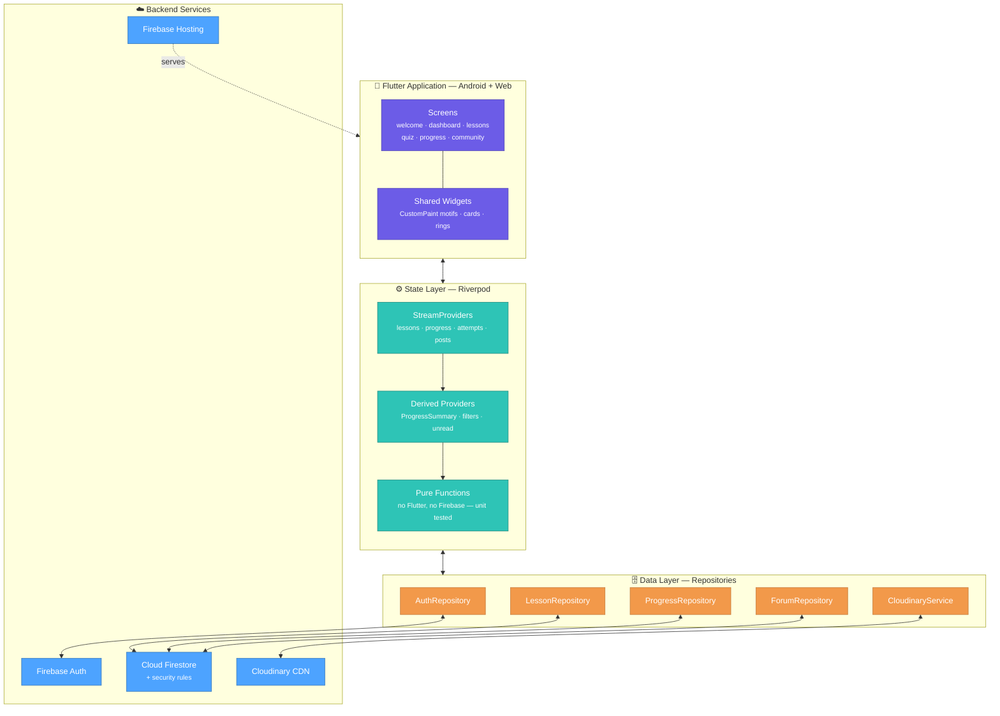

**The rule the layering enforces:** a widget never imports `cloud_firestore`. A
screen watches a provider, a provider calls a repository, and a repository is
the only thing holding a database handle. Everything that computes a number is a
pure function with no framework dependency — which is precisely why 154 tests
run in under ten seconds with no emulator.

### 6.2 Data model

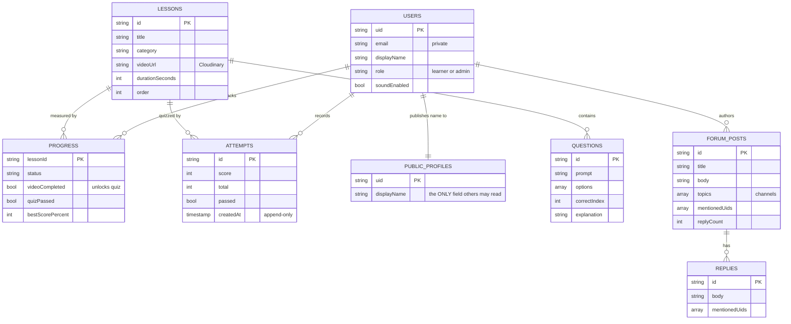

**Two decisions worth defending.** First, `public_profiles` duplicates a display
name rather than opening up `users/{uid}`, because that document holds an email
and a role and Firestore rules cannot restrict a read to particular *fields* —
so "everyone may read everyone's name" is only expressible as a second
collection. Second, progress and attempts live *under* the user rather than in
top-level collections, which reduces their security rule to "this user only"
with no query-level filtering to get wrong.

### 6.3 Security model

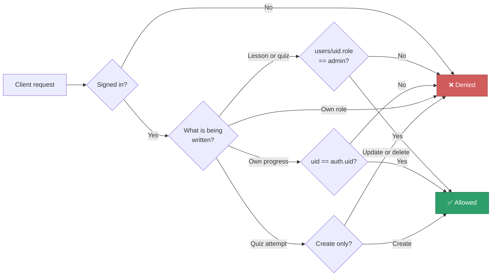

Admin is grantable **only** from the Firebase console — the rules explicitly
forbid a user changing their own role, so privilege cannot be escalated from the
client. Quiz attempts are append-only, so a score cannot be retroactively
improved.

---

## 7. Key Components

### 7.1 Live progress engine

The single most important component. Nothing derived is stored.

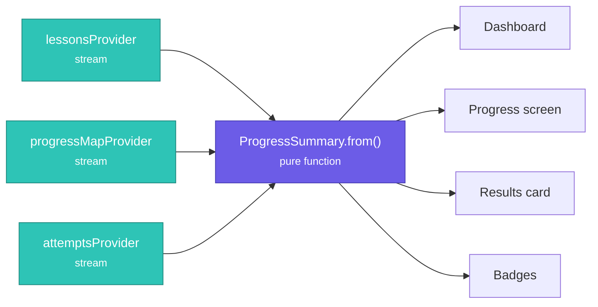

Submitting a quiz writes the attempt and the progress document **in one
transaction**. Both streams fire, the summary recomputes, every watching screen
rebuilds. This is why the dashboard percentage has already moved by the time the
learner navigates back to it.

### 7.2 Component inventory

| Component | File | Responsibility |
| --- | --- | --- |
| **Role-split dashboard** | `dashboard_screen.dart` | Routes to a learner course or an admin console from the same `/home`, reading the same role field the rules enforce |
| **Lesson path** | `lesson_path.dart` | Draws the library as a curve; the lit portion *is* the completion fraction |
| **Progress summary** | `progress_summary.dart` | The only file that computes a statistic; pure Dart, no Firebase import |
| **Lesson state machine** | `progress_repository.dart` | Three transactional writes move a lesson between three states |
| **Security rules** | `firestore.rules` | Server-side enforcement of the role split and data ownership |
| **Channel system** | `channels.dart` | Channel membership, unread counts, title derivation — all pure |
| **Mention system** | `mentions.dart` | Handle parsing, resolution to uids, render spans |
| **Cloudinary upload** | `cloudinary_service.dart` | Unsigned multipart upload; no secret in the binary |
| **Signing-space motif** | `signing_space.dart` | The brand visual, drawn with `CustomPaint` and `PathMetric` |
| **Auth redirect** | `app_router.dart` | Pure function deciding every route decision; fully unit-tested |

### 7.3 The lesson state machine

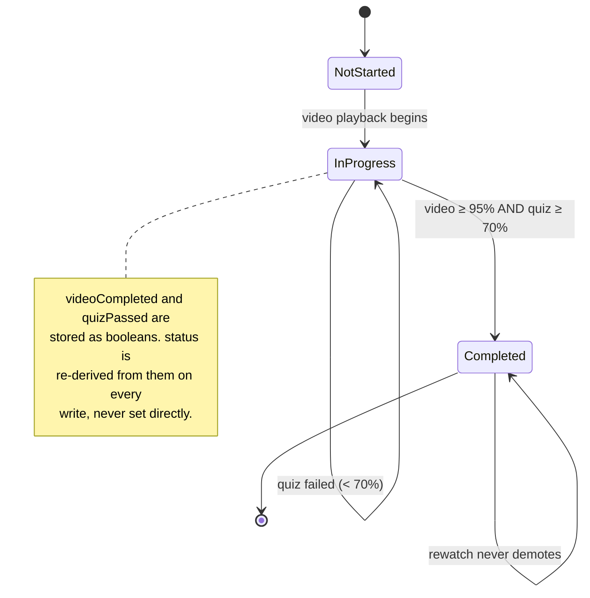

Video counts as watched at **95%**, not 100% — trailing frames are unreachable
on some codecs, and demanding completion would lock the quiz permanently.

---

## 8. Workflow Diagrams

### 8.1 Merged — the complete system

```mermaid
flowchart TB
    START(["Visitor opens Signals"]) --> LAND["Landing page<br/><small>motto · the case · how it works</small>"]
    LAND --> AUTH{"Has an<br/>account?"}
    AUTH -->|No| SIGNUP["Sign up<br/><small>email or Google</small>"]
    AUTH -->|Yes| LOGIN["Sign in"]
    SIGNUP --> PROFILE["users/uid created<br/>public_profiles/uid published"]
    LOGIN --> PROFILE
    PROFILE --> ROLE{"role?"}

    ROLE -->|admin| CONSOLE["Library console"]
    CONSOLE --> UPLOAD["Select video"]
    UPLOAD --> CLOUD["Upload to Cloudinary<br/><small>unsigned</small>"]
    CLOUD --> WRITEL["Write lesson + questions<br/><small>one batch</small>"]
    WRITEL --> LIVE(("Live for every<br/>learner instantly"))

    ROLE -->|learner| DASH["Learner dashboard"]
    DASH --> PATH["Lesson path<br/><small>next lesson highlighted</small>"]
    PATH --> WATCH["Watch video"]
    WATCH --> P95{"≥ 95%<br/>watched?"}
    P95 -->|No| WATCH
    P95 -->|Yes| UNLOCK["Quiz unlocked"]
    UNLOCK --> QUIZ["Take quiz"]
    QUIZ --> MARK{"Score<br/>≥ 70%?"}
    MARK -->|No| RETRY["Review explanations"]
    RETRY --> QUIZ
    MARK -->|Yes| TXN["Transaction:<br/>attempt + progress"]
    TXN --> RECOMP["Streams fire →<br/>summary recomputes"]
    RECOMP --> DASH

    DASH --> COMM["Community"]
    COMM --> CHAN["Pick a channel"]
    CHAN --> MSG["Send a message"]
    MSG --> MENTION{"Contains<br/>@mention?"}
    MENTION -->|Yes| RESOLVE["Resolve handles → uids<br/><small>stored on the document</small>"]
    MENTION -->|No| POST["Write post"]
    RESOLVE --> POST
    POST --> NOTIFY(("Appears live for<br/>everyone; mentioned<br/>learner sees a badge"))

    LIVE -.new lessons appear.-> PATH

    classDef entry fill:#6C5CE7,stroke:#4a3fb5,color:#fff
    classDef admin fill:#F2994A,stroke:#c37a3a,color:#fff
    classDef learner fill:#2EC4B6,stroke:#1f8a80,color:#fff
    classDef comm fill:#4DA3FF,stroke:#3576b8,color:#fff
    classDef done fill:#2E9E6B,stroke:#1f6f4a,color:#fff
    class START,LAND,SIGNUP,LOGIN,PROFILE entry
    class CONSOLE,UPLOAD,CLOUD,WRITEL admin
    class DASH,PATH,WATCH,UNLOCK,QUIZ,TXN,RECOMP learner
    class COMM,CHAN,MSG,RESOLVE,POST comm
    class LIVE,NOTIFY done
```

### 8.2 Authentication and routing

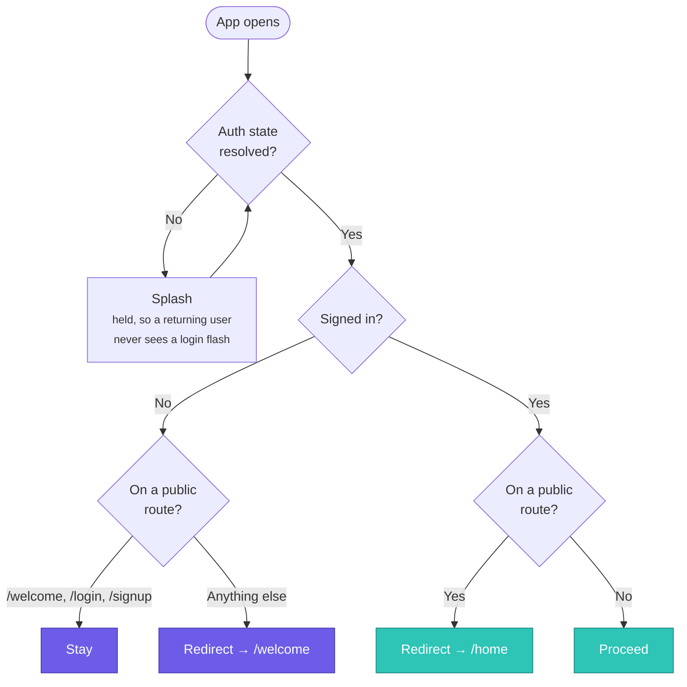

`authRedirect()` is a free function with no Flutter dependency, so every rule
above is unit-tested without mounting a navigator.

### 8.3 Admin publishing

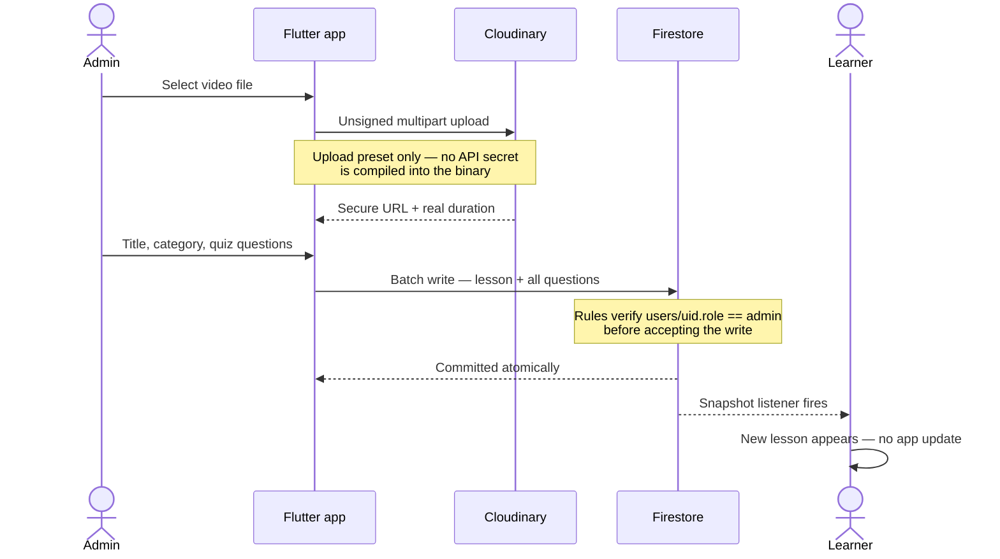

### 8.4 Lesson, video and quiz

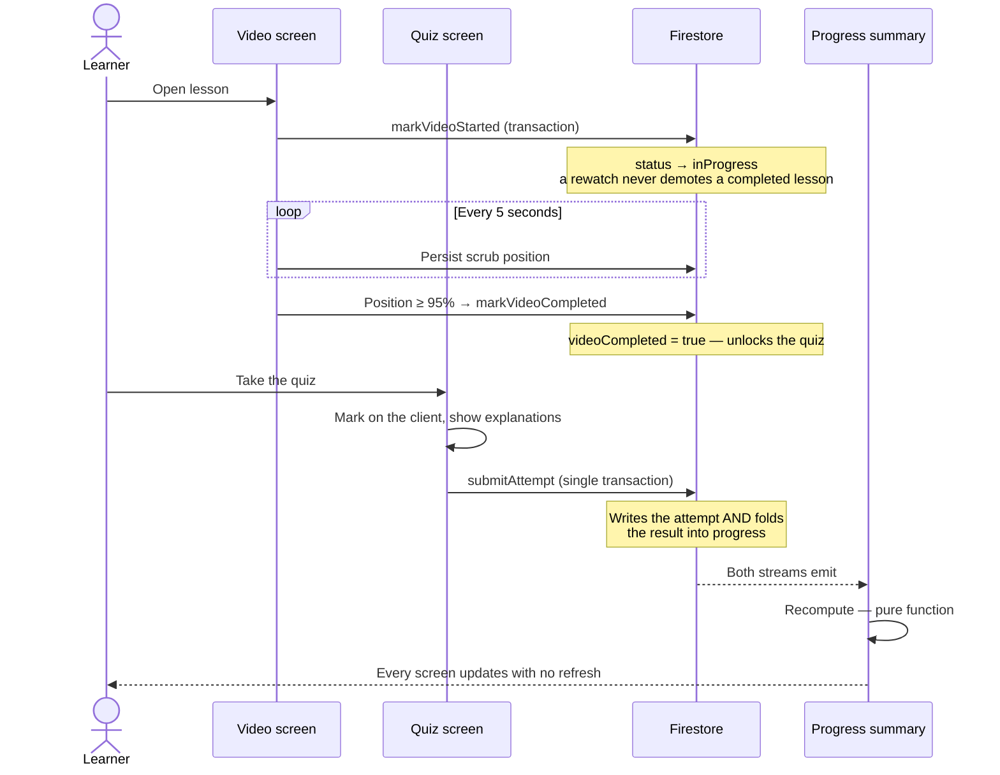

### 8.5 Community and mentions

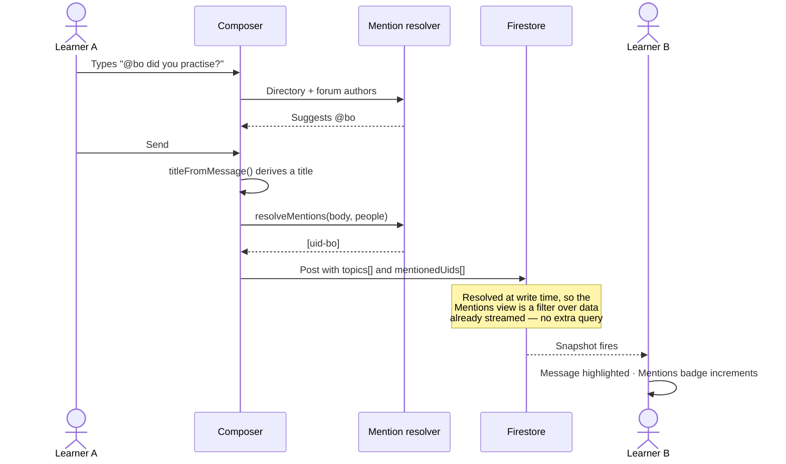

---

## 9. Learner Flow

The complete journey, from stranger to signing.

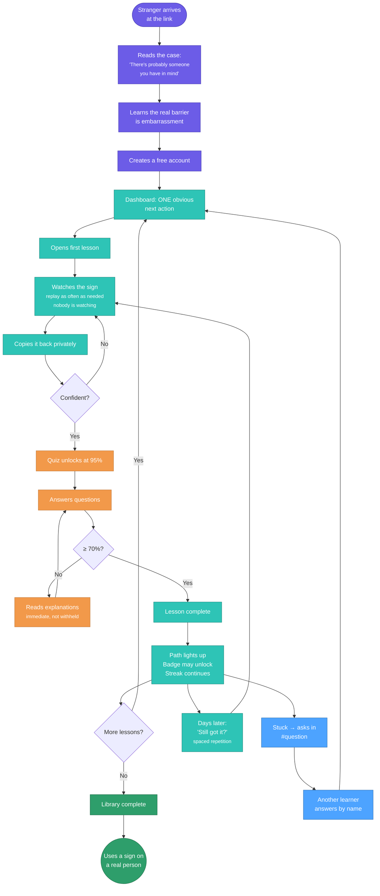

**The design intent in one sentence:** every loop in this diagram is one a
learner can run alone, at their own pace, without being observed — and the only
step that involves another person is the one they choose.

---

## 10. Screenshots

> **[PLACEHOLDER — insert captured screenshots below.]**
> Capture at 1440×900 for web and on a physical device for mobile. Replace each
> placeholder path with the real image.

| # | Screen | Suggested caption | Image |
| --- | --- | --- | --- |
| 1 | Landing page (hero) | The motto, with the object of the sentence cycling | `` |
| 2 | Landing page (the case) | "There's probably someone you have in mind" | `` |
| 3 | Landing page (respect panel) | "A language, not a workaround" | `` |
| 4 | Learner dashboard | One obvious next action, progress woven into the header | `` |
| 5 | Lesson path | The library as a route; the lit curve is the real completion fraction | `` |
| 6 | Admin console | Same route, different role — metrics, coverage, attention queue | `` |
| 7 | Lesson library | Cards washed with their category colour | `` |
| 8 | Video lesson | Replay privately, as often as needed | `` |
| 9 | Quiz | Immediate marking with explanations | `` |
| 10 | Results | Progress has already moved | `` |
| 11 | Progress screen | 14-day practice chart and category breakdown | `` |
| 12 | Community (desktop) | Channel rail beside the transcript | `` |
| 13 | Community (mention) | A message naming you, highlighted | `` |
| 14 | Dark mode | Validated category colours in both modes | `` |
| 15 | Android build | Running on a physical device | `` |

---

## 11. Conclusion

Signals is a complete, deployed, cross-platform application that addresses a
real communication gap with a free product and a defensible architecture.

The engineering position worth stating plainly: **every number the app displays
is computed from real user data by a pure function at the moment it is shown**,
the role split is **enforced by the database rather than hidden by the
interface**, and the whole system runs **at zero cost** on free tiers — which is
what makes it sustainable as a public good rather than a demonstration.

The social position matters more. The app does not present sign language as a
disability accommodation. It presents it as a language worth learning, says so
in its own interface, and sends its learners onward to the Deaf teachers who can
take them further than an app ever will.

---

| Deliverable | Location |
| --- | --- |
| Live web application | https://signals-app-a7b29.web.app |
| Source repository | https://github.com/sujalwarke28/Signals-Learn-Sign-Language |
| Android APK | `release/` in the repository working tree |
| Full documentation | [`docs/00-index.md`](00-index.md) — 17 documents |
| Architecture detail | [`docs/12-architecture.md`](12-architecture.md) |
| Security rules | [`firestore.rules`](../firestore.rules) |
